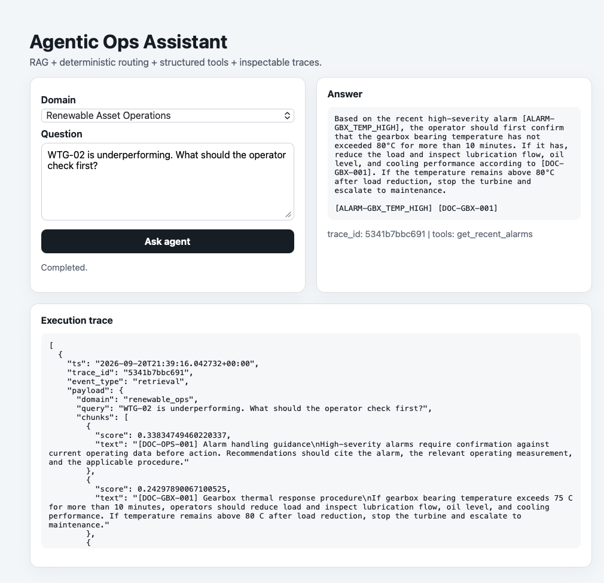

# Agentic Ops Assistant

[](https://github.com/schraelbert/agentic-ops-assistant/actions/workflows/ci.yml)
[](LICENSE)

A compact, production-minded agentic AI project combining retrieval-augmented generation (RAG), structured tool use, deterministic routing, execution traces, evaluation, FastAPI, Docker, and pluggable local-first model/integration boundaries.

The core is intentionally domain-agnostic. Domain prompts, documents, synthetic data, routing rules, and tools live behind adapters, so new use cases can be added without rewriting the agent loop.

## Web UI



The web interface lets you:
- select a domain
- ask an operational question
- inspect the answer and tool calls
- view the full execution trace

## What this demonstrates

- local-first LLM orchestration with Ollama plus an optional OpenAI-compatible provider interface;
- embedding-based retrieval over domain documents;
- structured tool selection and multi-step tool use;
- Pydantic tool-input schemas with strict validation and normalization;
- deterministic prerequisite routing for query classes where prompt-only compliance is too fragile;
- authoritative argument binding between dependent tools;
- separation between reusable agent infrastructure and domain-specific logic;
- an interchangeable local/REST backend adapter for the service-operations domain;
- grounded answers that distinguish retrieved policy/procedure from current tool data;
- final-answer evidence validation for citation provenance, executed-tool consistency, canonical reference normalization, and domain-specific evidence scope;
- JSONL execution traces plus trace-inspection API endpoints;
- transparent per-domain evaluations with hard gates for required evidence and tools;
- repeatable consistency runs plus adversarial suites for missing data and unsafe tool chains;
- a lightweight browser UI for interactive demos;
- FastAPI, Docker Compose, tests, and GitHub Actions CI.

## Demo domains

### Renewable Asset Operations

Synthetic wind-turbine operations data and procedures.

Example questions:

- `WTG-02 is underperforming. What should the operator check first?`
- `What is the approximate current capacity factor of WTG-01?`
- `What does the procedure say when gearbox bearing temperature stays above 80 C after load reduction?`

The agent can retrieve operating procedures, inspect synthetic alarms and asset state, and run deterministic calculations.

### Service Support Operations

A second, non-energy domain demonstrates that the same agent core can support SaaS/customer-service operations.

Example questions:

- `TCK-101 is urgent. What should support check first?`
- `How much SLA time remains for TCK-101?`
- `What does the policy say about service credits?`

The agent can retrieve support policy, inspect synthetic tickets and incidents, and calculate SLA remaining time from authoritative ticket values.

## Architecture

```text
Browser / API client
        |
        v
   FastAPI /ask
        |
        v
 AgenticOpsAssistant
   /      |       \
  v       v        v
RAG   preflight   domain tools
      routing
  \       |       /
   \      v      /
      ChatClient
     /         \
 Ollama    OpenAI-compatible
 (local)    HTTP endpoint
      \         /
          v
 answer + tool calls + trace
```

Domain-specific pieces are isolated under `domains/`:

```text
agentic-ops-assistant/
├── app/                     # reusable agent core + web UI
│   ├── adapters/             # reusable HTTP integration boundary
│   ├── agent.py
│   ├── domain_registry.py
│   ├── evidence.py
│   ├── llm.py
│   ├── main.py
│   ├── retrieval.py
│   ├── trace.py
│   └── static/
├── domains/
│   ├── renewable_ops/
│   │   ├── domain.py
│   │   ├── routing.py
│   │   ├── tools.py
│   │   └── data/
│   └── service_ops/
│       ├── domain.py
│       ├── routing.py
│       ├── tools.py
│       └── data/
├── examples/                 # local mock REST service
├── evals/
├── tests/
├── .github/workflows/ci.yml
├── docs/design.md
├── Dockerfile
├── Dockerfile.mock
├── docker-compose.rest-adapter.yml
└── docker-compose.yml
```

## Docker Compose compatibility

Examples below use the standalone `docker-compose` command because it works with Colima setups that do not have the Docker Compose v2 plugin installed. If your Docker installation provides Compose v2, the equivalent command is `docker compose`. No paid GitHub, cloud, model, vector-database, or telemetry service is required.

## Quick start

The default setup is fully containerized: the API and Ollama run as separate services on the same Docker network. A one-shot `model-init` service pulls the configured model into a persistent Ollama volume.

### 1. Start the stack

```bash
cp .env.example .env
docker-compose up --build
```

On first run Docker pulls Ollama, builds the API image, downloads the configured LLM (default: `qwen2.5:7b`), and caches the embedding model. Later starts reuse the named volumes.

Check status:

```bash
docker-compose ps
```

Open the interactive UI at:

```text
http://localhost:8000
```

Health check:

```bash
curl http://localhost:8000/health
```

### 2. Ask through the API

```bash
curl -X POST http://localhost:8000/ask \
  -H 'Content-Type: application/json' \
  -d '{"domain":"renewable_ops","question":"WTG-02 is underperforming. What should the operator check first?"}'
```

Second domain:

```bash
curl -X POST http://localhost:8000/ask \
  -H 'Content-Type: application/json' \
  -d '{"domain":"service_ops","question":"TCK-101 is urgent. What should support check first?"}'
```

### Optional: reuse Ollama already running on the host

```bash
docker-compose -f docker-compose.external-ollama.yml up --build
```

This developer mode defaults Hugging Face / Transformers to offline mode so an already cached embedding model is reused without network checks. On a fresh machine with an empty `hf_cache` volume, allow one initial cache fill with:

```bash
HF_HUB_OFFLINE=0 TRANSFORMERS_OFFLINE=0 \
  docker-compose -f docker-compose.external-ollama.yml up --build
```

After the embedding model is cached, return to the normal command above. Model files are downloaded from Hugging Face only; no paid API or account is required.

This mode points the API container to `host.docker.internal:11434`. The default `docker-compose.yml` remains the self-contained setup intended for reproducible demos.

### Optional: exercise the REST adapter locally

The service-operations domain can switch from repository-local JSON data to a real HTTP integration boundary. The included mock service runs locally and requires no account or external network access:

```bash
docker-compose -f docker-compose.external-ollama.yml -f docker-compose.rest-adapter.yml up --build
```

With this override, `service_ops` obtains tickets and incidents over HTTP from `mock-service`, while the agent core and tool contracts remain unchanged.

### Optional: use another OpenAI-compatible local server

Ollama remains the default. To exercise the provider boundary with a local OpenAI-compatible server (for example LM Studio or vLLM), set:

```bash
export LLM_PROVIDER=openai_compatible
export OPENAI_COMPAT_BASE_URL=http://host.docker.internal:1234/v1
export OPENAI_COMPAT_MODEL=your-local-model
```

No hosted API or API key is required by the repository.

### Stop the stack

```bash
docker-compose down
```

To also delete downloaded model/cache volumes:

```bash
docker-compose down -v
```

## Trace inspection

Every `/ask` response includes a `trace_id`. List recent traces:

```bash
curl 'http://localhost:8000/traces/recent?limit=10'
```

Inspect one full execution path:

```bash
curl http://localhost:8000/trace/<trace_id>
```

Events include retrieval, deterministic routing, tool execution, model output, and validation where applicable. Raw JSONL traces are persisted under `traces/`.

## Evaluation

The evaluation runner reports required-tool use, key answer terms, evidence references, unsupported-claim checks, final-answer evidence-validation issues, latency, and an overall score. Required tools, required references, forbidden evidence, and unresolved evidence-validation issues are hard gates, so a fluent answer cannot pass by skipping prerequisite evidence.

Renewable domain:

```bash
docker-compose -f docker-compose.external-ollama.yml exec api \
  python -m evals.run_evals --domain renewable_ops
```

Service-operations domain:

```bash
docker-compose -f docker-compose.external-ollama.yml exec api \
  python -m evals.run_evals --domain service_ops --output evals/service_ops_report.json
```

The suite is deliberately small and inspectable rather than presented as a general agent benchmark.

Repeat every standard case three times to measure behavioral consistency:

```bash
docker-compose -f docker-compose.external-ollama.yml exec api \
  python -m evals.run_evals --domain renewable_ops --repeat 3
```

Adversarial suites exercise missing identifiers, tool-chain stopping, forbidden tools, unsupported claims, and irrelevant-document contamination:

```bash
docker-compose -f docker-compose.external-ollama.yml exec api \
  python -m evals.run_evals --domain renewable_ops --suite adversarial \
  --output evals/renewable_ops_adversarial_report.json

docker-compose -f docker-compose.external-ollama.yml exec api \
  python -m evals.run_evals --domain service_ops --suite adversarial \
  --output evals/service_ops_adversarial_report.json
```

### Current validated result

On 2026-09-20, the renewable demo suite passed **3/3 cases in three consecutive local runs** with the configured `qwen2.5:7b` model. This is a stability check for the included synthetic scenarios, not a claim of general model accuracy.

## Design notes

The engineering decisions behind routing, evidence validation, tool contracts, provider boundaries, and external integrations are documented in [docs/design.md](docs/design.md).

## Cost and privacy posture

The default and example stacks use local containers, local models, and synthetic data only. No paid model API, hosted vector database, cloud account, telemetry vendor, or external SaaS subscription is required. GitHub Actions runs deterministic unit tests only; it does not start an LLM or call any paid endpoint.

## Reliability choices

- Current operational facts come from tools rather than model memory.
- Procedures and policy come from retrieved local documents.
- Domain adapters define their own evidence and safety boundaries.
- Deterministic preflight routing guarantees prerequisite evidence for selected query classes instead of relying only on prompt compliance.
- Dependent tool inputs can be bound to exact fields from prior authoritative results.
- Pydantic schemas reject extra fields and invalid numeric ranges before a tool executes.
- If an authoritative prerequisite tool returns an error, dependent preflight calls are stopped rather than guessed.
- Deterministic calculations are performed in Python tools rather than improvised by the LLM.
- Final-answer validation catches leaked pseudo-tool syntax and requests a clean rewrite.
- Deterministic output cleanup removes residual argument fragments and dangling tool-invocation prose before evidence validation.
- Narrow deterministic answer sanitization removes unsupported subsystem advice when the executed evidence does not support it.
- Execution-status validation prevents answers from claiming that a prerequisite tool was not executed when the trace shows that it ran and returned an error/missing-data result.
- Evidence guards distinguish operational IDs from document IDs (for example, `INC-77` versus `[DOC-INC-001]`) to avoid false-positive validation failures.
- Tool references are first normalized deterministically: executed tools are canonicalized to `[TOOL:<name>]`, malformed payload-style citations are collapsed to the canonical form, and references to unexecuted tools are removed before semantic evidence validation. Placeholder references such as `[ALARM-...]` are rejected.
- Evidence validation allows only document IDs from retrieved chunks, tool references for tools that actually executed, and alarm/incident IDs observed in tool results.
- Domain evidence guards reject selected subsystem- or incident-specific claims when current operational evidence does not support them.
- Document-only answers are prevented from citing operational tools that were not executed, and tool references use one canonical `[TOOL:<name>]` format.
- Retrieval, routing, tool calls, validation, and model outputs are logged with trace IDs.
- The repository uses synthetic data only.

## Why deterministic routing is included

The project deliberately does not treat full LLM autonomy as a virtue by itself. For narrow query classes where skipping prerequisite evidence would make the answer unreliable, a small transparent router executes required tools first.

Examples:

- wind-turbine underperformance -> inspect recent alarms;
- current capacity factor -> get current asset state -> deterministic calculation;
- urgent support ticket -> load current ticket -> correlate service incidents;
- SLA remaining time -> load current ticket -> deterministic calculation;
- procedure/policy-only question -> no operational tool call.

The LLM still performs retrieval-grounded synthesis and may request additional tools, but prerequisite evidence is not left to prompt compliance alone. Final answers first pass through narrow deterministic citation normalization, then a deterministic evidence check. If unsupported alarm/incident IDs or selected domain-specific claims remain outside current evidence, the model is asked to rewrite the answer against the available evidence.

## Adding another domain

A new domain needs:

1. a system prompt and document path;
2. tool specifications, Pydantic input schemas, and deterministic functions/adapters;
3. optional preflight routing rules;
4. domain data or external API adapters;
5. registration in `app/domain_registry.py`;
6. focused tests and evaluation cases.

The two included adapters show the same orchestration loop operating across asset operations and service-support workflows.

## CI

GitHub Actions runs the deterministic unit-test suite on pushes to `main` and on pull requests.

Local test command:

```bash
pytest -q
```

The CI suite intentionally avoids starting an LLM and installs only the lightweight dependencies needed for deterministic tests. Model-dependent behavior is covered by the explicit evaluation runner so CI remains fast and repeatable.

## Roadmap

- add optional pgvector or Qdrant retrieval backends;
- add OpenTelemetry-compatible traces plus token and latency metrics;
- add role/specialist handoffs only where they materially improve task quality;
- add authentication/access-control examples for external tool adapters.

## License

MIT. See [LICENSE](LICENSE).
